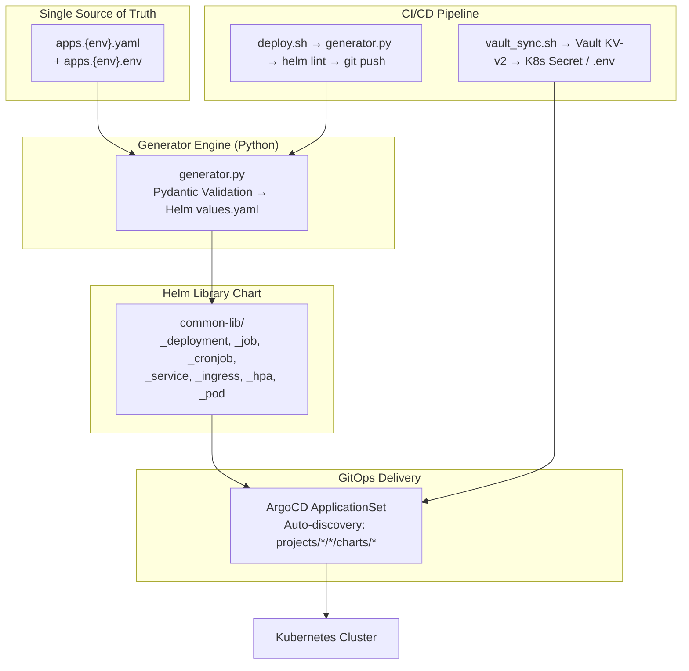

# GitOps Engine — Comprehensive Code Review

> **Reviewer Role**: DevSecOps Expert (K8s, Helm, Python)
> **Date**: 2026-04-21
> **Scope**: Full codebase — scripts/, helm-templates/, argocd/, .gitlab-ci.yml, examples/

---

## 1. Architecture Overview



**Design Pattern**: Library Chart + Python meta-generator. Đây là một kiến trúc tốt cho monorepo vì:
- ✅ DRY — Một library chart cho mọi microservice
- ✅ Declarative — `apps.yaml` là nguồn cấu hình duy nhất
- ✅ Idempotent — Generator an toàn khi chạy lặp lại
- ✅ Separation of Concerns — Python xử lý logic, Helm xử lý rendering

---

## 2. Security Assessment

### 2.1 Điểm mạnh (đã được harden)

| Category | Implementation | Rating |
|:---|:---|:---|
| Container Security | `readOnlyRootFilesystem: true`, `allowPrivilegeEscalation: false`, `capabilities.drop: ALL` | ✅ Excellent |
| Pod Security | `runAsNonRoot: true`, `runAsUser/Group: 1000`, `fsGroup: 1000` | ✅ Excellent |
| SA Token Control | `automountServiceAccountToken: false` by default | ✅ Excellent |
| Shell Injection | `vault_sync.sh` sử dụng `os.environ` thay vì string interpolation | ✅ Fixed |
| CI Git Auth | SSH deploy key thay vì embed token trong URL | ✅ Fixed |
| Strict Mode | `set -euo pipefail` trên tất cả shell scripts | ✅ Correct |
| Command Injection | `deploy.sh` sử dụng bash array `("${CMD[@]}")` | ✅ Fixed |
| Input Validation | Pydantic `extra='forbid'`, K8s name regex, semver validation | ✅ Solid |
| /tmp AutoMount | Auto emptyDir cho `readOnlyRootFilesystem` + dedup logic | ✅ Smart |
| Init Container Isolation | Không inject configMap, không force securityContext, không auto /tmp | ✅ Correct |

### 2.2 Vấn đề bảo mật còn tồn tại

#### 🔴 CRITICAL

**[SEC-C1] ArgoCD ApplicationSet — Automated Prune Without Diff Protection**
- File: [applicationset.yaml](file:///home/cuong/DevOps/gitops-engine/argocd/applicationset.yaml#L44-L49)
- `automated.prune: true` + `selfHeal: true` mà KHÔNG có `syncOptions: ServerSideApply=true` hoặc `ApplyOutOfSyncOnly=true`
- **Risk**: Nếu generator bị lỗi xóa toàn bộ charts, ArgoCD sẽ tự động xóa tất cả resources trên cluster
- **Fix**: Thêm `syncOptions: [ServerSideApply=true]` và cân nhắc `automated.prune: false` cho production

**[SEC-C2] CI Pipeline — `CI_PUSH_TOKEN` Fallback Vẫn Leak Token Qua Git URL**
- File: [.gitlab-ci.yml](file:///home/cuong/DevOps/gitops-engine/.gitlab-ci.yml#L41)
- Dòng 41 vẫn embed `CI_PUSH_TOKEN` vào HTTPS URL khi SSH key không khả dụng
- **Risk**: Token bị leak trong `git remote -v`, error messages, process list
- **Fix**: Nếu SSH key không khả dụng → fail hard, không fallback sang HTTP token embedding

#### 🟡 HIGH

**[SEC-H1] `deploy.sh` — Không validate `$PROJECT` và `$ENV` trước khi dùng trong path**
- File: [deploy.sh](file:///home/cuong/DevOps/gitops-engine/scripts/deploy.sh#L68)
- `TARGET_DIR="projects/${ENV}/${PROJECT}/charts"` — không kiểm tra path traversal
- `generator.py` có validate `--env`, nhưng `deploy.sh` gọi `git status --porcelain "$TARGET_DIR"` trực tiếp
- **Fix**: Thêm regex validation cho `$PROJECT` tương tự `--env` validation trong generator.py

**[SEC-H2] `vault_sync.sh` — Vault Token Không Được Validate Scope**
- File: [vault_sync.sh](file:///home/cuong/DevOps/gitops-engine/scripts/vault_sync.sh#L54)
- `vault token lookup` chỉ kiểm tra token có valid, không kiểm tra policy/ACL
- **Risk**: Token có thể có quá nhiều quyền (over-privileged)
- **Recommendation**: Log token policies và cảnh báo nếu token là root

**[SEC-H3] Không có Resource Quotas / LimitRange trong generated charts**
- Generator không bắt buộc field `resources` — apps có thể deploy mà không có resource limits
- **Risk**: Noisy neighbor, resource exhaustion
- **Fix**: Thêm validation warning khi `resources` trống, hoặc inject default limits

#### 🟠 MEDIUM

**[SEC-M1] `examples/.gitlab-ci.yml.example` — Vẫn dùng HTTP Token Auth (Stale)**
- File: [.gitlab-ci.yml.example](file:///home/cuong/DevOps/gitops-engine/examples/.gitlab-ci.yml.example#L28)
- Dòng 28 dùng `CI_JOB_TOKEN` trong HTTPS URL — example cũ chưa được cập nhật
- **Fix**: Sync example với `.gitlab-ci.yml` chính (SSH deploy key pattern)

**[SEC-M2] NetworkPolicy không được generate**
- Không có template cho NetworkPolicy trong common-lib
- **Risk**: Tất cả pods có thể giao tiếp với nhau (flat network)
- **Recommendation**: Thêm optional NetworkPolicy template

**[SEC-M3] Image Digest Pinning — Chưa hỗ trợ**
- Generator chỉ hỗ trợ `:tag`, không hỗ trợ `@sha256:digest`
- **Risk**: Tag có thể bị overwrite (tag mutation attack)

---

## 3. Code Quality — `generator.py` (1391 LOC)

### 3.1 Điểm mạnh

| Aspect | Assessment |
|:---|:---|
| **Pydantic Models** | Rất tốt — `extra='forbid'` ngăn chặn typo, `model_validator` có logic rõ ràng |
| **DRY Principle** | `_resolve_image()` được extract thành helper, dùng shared ở container + app level |
| **Documentation** | Docstrings chi tiết, giải thích lý do thiết kế (WHY not WHAT) |
| **Type Hints** | Sử dụng `Optional`, `Union`, `Literal` — type safety tốt |
| **Edge Cases** | `emptyDir: {}` falsy handling, `storageClass: ""` — được cover kỹ |
| **Error Messages** | Descriptive, actionable — user biết phải fix gì |

### 3.2 Các vấn đề phát hiện

#### 🟡 HIGH — Logic Issues

**[PY-H1] Duplicate Security Context Construction**
- File: [generator.py](file:///home/cuong/DevOps/gitops-engine/scripts/generator.py#L848-L854) và [L1020-L1025](file:///home/cuong/DevOps/gitops-engine/scripts/generator.py#L1020-L1025)
- `default_sec_ctx` được xây dựng ở 2 nơi: `_build_container_dict()` (L849) và `build_values_yaml()` (L1020)
- Cả hai đều giống nhau — nhưng nếu chỉnh sửa một nơi sẽ gây inconsistency
- **Fix**: Extract thành constant `_DEFAULT_CONTAINER_SEC_CTX` giống `_DEFAULT_POD_SEC_CTX`

**[PY-H2] `build_values_yaml()` quá dài — 269 LOC (L970-L1238)**
- Hàm chính chứa 14 steps, khó maintain và test từng phần
- **Recommendation**: Extract thành các sub-functions:
  - `_resolve_ports(app) → all_ports`
  - `_build_service_values(app, all_ports) → svc_values`
  - `_build_ingress_values(app, svc_ports, primary_port) → ing_values`

**[PY-H3] Image Repository Extraction Brittle**
- File: [generator.py](file:///home/cuong/DevOps/gitops-engine/scripts/generator.py#L1087)
- `main_container.pop("image").split(":")[0]` — nếu image có port (e.g., `registry:5000/app:v1`), `split(":")` sẽ sai
- **Fix**: Dùng `image_name` variable đã có sẵn thay vì re-parse từ container dict:
  ```python
  image_info = {
      "repository": image_name,  # Already resolved correctly by _resolve_image()
      "tag": tag,
      "pullPolicy": main_container.pop("imagePullPolicy")
  }
  main_container.pop("image")  # Still need to remove from container dict
  ```

#### 🟠 MEDIUM

**[PY-M1] `_pod.tpl` Renders Ports for Jobs — Incorrect**
- File: [_pod.tpl](file:///home/cuong/DevOps/gitops-engine/helm-templates/common-lib/templates/_pod.tpl#L39-L48)
- Line 39: `if or (eq .Values.type "deployment") (not .Values.deployment.ports)` — logic khá rối
- Điều kiện này render ports cho tất cả types nếu `deployment.ports` không tồn tại, kể cả Job
- Thực tế Job/CronJob không cần container ports (mặc dù K8s chấp nhận, nó gây confusion)
- **Fix**: Chỉ render ports khi `type == "deployment"`:
  ```yaml
  {{- if eq .Values.type "deployment" }}
  ports:
    {{- toYaml .Values.deployment.ports | nindent 6 }}
  {{- end }}
  ```

**[PY-M2] Thiếu `values.yaml` trong shared-chart cho `project-shared`**
- File: [generator.py](file:///home/cuong/DevOps/gitops-engine/scripts/generator.py#L1322-L1352)
- `project-shared` chart chỉ có `Chart.yaml` + templates, không có `values.yaml`
- Helm 3 sẽ lint warning, nhưng hoạt động
- **Fix**: Thêm `values.yaml: {}` trống

**[PY-M3] Batch Workload — Missing `restartPolicy` Injection into Pod Template**
- File: [_job.yaml](file:///home/cuong/DevOps/gitops-engine/helm-templates/common-lib/templates/_job.yaml#L54-L56)
- `_pod.tpl` (podSpec) không render `restartPolicy` — nó được render BÊN NGOÀI podSpec trong `_job.yaml`
- Hiện tại hoạt động đúng vì `restartPolicy` nằm ở `spec.template.spec` level
- Nhưng `_pod.tpl` render từ `spec.template.spec` level, nên `restartPolicy` bị duplicate render:
  - `_job.yaml:L55` render ở TRƯỚC `podSpec`
  - `podSpec` bắt đầu từ `imagePullSecrets` — OK, không conflict
- ✅ Thực ra logic này ĐÚNG — `restartPolicy` phải ở cùng level với `containers:`, và `podSpec` output bắt đầu từ `imagePullSecrets` cùng level

**[PY-M4] `temp.md` — File tạm không nên commit**
- File: [temp.md](file:///home/cuong/DevOps/gitops-engine/temp.md) chứa script thủ công
- **Fix**: Thêm vào `.gitignore` hoặc xóa

#### 🟢 LOW

**[PY-L1] Jinja2 trong `requirements.txt` nhưng không được import**
- `Jinja2>=3.1.4` được khai báo nhưng `generator.py` không import Jinja2
- Có thể là dependency dự phòng hoặc tàn dư
- **Fix**: Xóa nếu không cần, hoặc document lý do giữ lại

**[PY-L2] `__pycache__` nên thêm vào `.gitignore` global**
- `.gitignore` chỉ có `scripts/__pycache__/*` — nếu thêm module mới ở thư mục khác sẽ bị miss
- **Fix**: `__pycache__/` (global pattern)

**[PY-L3] README hoàn toàn bằng tiếng Việt**
- Open source repo trên GitHub nên có ít nhất README tiếng Anh
- Comments trong code đã được chuyển sang tiếng Anh — nên đồng bộ

**[PY-L4] `examples/.gitlab-ci.yml.example` — Base image `python:3.9-slim` quá cũ**
- Main pipeline dùng `python:3.11-slim`, example vẫn dùng `3.9-slim`
- **Fix**: Sync version

---

## 4. Test Suite — `test_generator.py` (1074 LOC, 146 tests)

### 4.1 Coverage Assessment

| Component | Test Coverage | Rating |
|:---|:---|:---|
| Pydantic Validation | EnvItem, VolumeItem, ProjectPVC, AppConfig, HPA | ✅ Excellent |
| build_env_items | All 5 source types | ✅ Excellent |
| build_volume_items | All 6 source types + mount options | ✅ Excellent |
| build_values_yaml | Integration test all major paths | ✅ Good |
| _resolve_image | 7 combination tests | ✅ Excellent |
| Security Contexts | Pod vs Container separation | ✅ Good |
| Init/Sidecar | 14 assertions including probe/injection isolation | ✅ Excellent |
| Job/CronJob | Type, config, service/ingress disabled | ✅ Good |
| HPA | Enabled/disabled, replicas omission, type guard | ✅ Good |
| parse_env_file | Quote handling, secret detection | ✅ Good |

### 4.2 Missing Test Coverage

| Gap | Risk | Priority |
|:---|:---|:---|
| `main()` CLI integration (argparse, file I/O) | No e2e test for actual chart generation | 🟡 HIGH |
| Helm template rendering (helm template) | Generator output is never actually rendered | 🟡 HIGH |
| `build_project_pvcs_yaml` multi-doc output | Only storageClass tested, not full multi-PVC | 🟠 MEDIUM |
| Ingress with multiple hosts/paths | Only single host tested | 🟠 MEDIUM |
| `deploy.sh` / `vault_sync.sh` scripts | No shell script tests | 🟠 MEDIUM |
| gRPC health probe rendering | Model accepts it, rendering not tested | 🟢 LOW |
| `write_yaml` / `ensure_dir` utilities | Trivial but untested | 🟢 LOW |
| Image with registry port (e.g., `registry:5000/app`) | Edge case for `_resolve_image` | 🟡 HIGH |

---

## 5. Helm Templates Quality

### 5.1 Điểm mạnh

| Template | Assessment |
|:---|:---|
| `_helpers.tpl` | Standard K8s labels, name truncation — follows Helm best practices |
| `_deployment.yaml` | `hasKey` for replicas (supports HPA mode) — excellent fix |
| `_pvc.yaml` | `hasKey` for storageClass — correct empty string handling |
| `_ingress.yaml` | `kindIs "float64"` for port type detection — smart |
| `_main.tpl` | Type routing with fail guard — defensive |
| `_pod.tpl` | Shared across Deployment/Job/CronJob — good DRY |

### 5.2 Vấn đề

**[HELM-H1] `_job.yaml` — `backoffLimit: 0` sẽ bị bỏ qua**
- File: [_job.yaml](file:///home/cuong/DevOps/gitops-engine/helm-templates/common-lib/templates/_job.yaml#L36-L37)
- `if .backoffLimit` → `0` là falsy trong Go template → field bị drop
- Tương tự cho `completions: 0`, `parallelism: 0`
- **Fix**: Dùng `hasKey` pattern giống `_deployment.yaml`:
  ```yaml
  {{- if hasKey . "backoffLimit" }}
  backoffLimit: {{ .backoffLimit }}
  {{- end }}
  ```

**[HELM-H2] `_cronjob.yaml` — Cùng bug `backoffLimit: 0`**
- Job template block trong CronJob có cùng vấn đề

**[HELM-H3] `_serviceaccount.yaml` — Missing `automountServiceAccountToken` Consistency**
- SA resource (L20) set `automountServiceAccountToken: false`
- Pod spec (`_pod.tpl` L16) CŨNG set `automountServiceAccountToken: false`
- Cả hai đều đúng nhưng Pod spec `automountServiceAccountToken` override SA-level setting
- ✅ Đây thực ra là ĐÚNG theo K8s precedence: Pod spec wins → defense-in-depth

---

## 6. CI/CD Pipeline

### 6.1 Điểm mạnh

| Feature | Assessment |
|:---|:---|
| `resource_group: git-push-lock` | Ngăn concurrent push — ✅ Critical for monorepo |
| Test stage TRƯỚC deploy | ✅ Blocks broken generator from committing |
| `[skip ci]` in commit message | ✅ Prevents infinite CI loop |
| `changes:` filter | ✅ Only runs when relevant files change |
| Retry logic with exponential backoff | ✅ Handles Git race conditions |

### 6.2 Vấn đề

**[CI-H1] Test Stage — Chỉ chạy khi files thay đổi**
- File: [.gitlab-ci.yml](file:///home/cuong/DevOps/gitops-engine/.gitlab-ci.yml#L55-L61)
- Test chỉ chạy khi `generator.py`, `test_generator.py`, hoặc `requirements.txt` thay đổi
- Nhưng KHÔNG chạy khi `apps.*.yaml` (config data) thay đổi — config change có thể trigger bugs
- **Fix**: Thêm `projects/**/*.yaml` vào changes trigger

**[CI-H2] `deploy-orchestration` — Không depend on `run-tests`**
- Nếu test stage bị skip (vì files không thay đổi), deploy vẫn chạy
- GitLab CI mặc định: nếu stage N không có job nào, stage N+1 vẫn chạy
- **Fix**: Thêm `needs: [run-tests]` với `optional: true` nếu muốn strict ordering

**[CI-M1] Missing Helm version pinning**
- CI base image `python:3.11-slim` không có Helm pre-installed
- `deploy.sh` gọi `helm lint` nhưng CI image không cài Helm
- Helm được expect ở đâu? Có thể CI chạy trên runner có Helm, nhưng không documented
- **Fix**: Pin Helm version trong CI hoặc document requirement

---

## 7. ArgoCD ApplicationSet

### 7.1 Điểm mạnh

| Feature | Assessment |
|:---|:---|
| Git directory generator | Auto-discovery — ✅ Scalable pattern |
| Namespace = project name | Isolation by design — ✅ |
| `CreateNamespace=true` | Hands-off operation — ✅ |
| Path-based labels | `project`, `env` labels for filtering — ✅ |

### 7.2 Vấn đề

**[ARGO-H1] `project-shared` chart có thể conflict với app name**
- ApplicationSet pattern `projects/*/*/charts/*` sẽ pick up `project-shared` chart
- Nếu nhều projects có `project-shared`, name collision: `name: '{{path.basename}}'` → `project-shared`
- **Fix**: Prefix app name: `name: '{{path.segments[2]}}-{{path.basename}}'`

**[ARGO-M1] Không có `argocd.argoproj.io/managed-by` annotation**
- Nên thêm annotations cho cluster admin tracing

**[ARGO-M2] Hardcoded `repoURL`**
- `https://github.com/cuonghv00/gitops-engine.git` — nên dùng variable hoặc helm values

---

## 8. Tổng kết & Đánh giá

### Scoring Matrix

| Domain | Score | Details |
|:---|:---|:---|
| **Security Hardening** | ⭐⭐⭐⭐☆ (4/5) | Container/Pod sec ctx excellent, nhưng ArgoCD auto-prune + token fallback là risk |
| **Code Architecture** | ⭐⭐⭐⭐☆ (4/5) | Pydantic models tốt, nhưng `build_values_yaml()` cần refactor |
| **Helm Templates** | ⭐⭐⭐⭐☆ (4/5) | DRY pattern tốt, `hasKey` pattern đúng, nhưng Job falsy bug |
| **CI/CD Pipeline** | ⭐⭐⭐⭐☆ (4/5) | Solid design, nhưng dependency chain cần tighten |
| **Test Coverage** | ⭐⭐⭐⭐☆ (4/5) | 146 tests excellent, thiếu e2e và helm template tests |
| **Documentation** | ⭐⭐⭐☆☆ (3/5) | Code comments tốt, README chỉ tiếng Việt, examples stale |
| **Overall** | **⭐⭐⭐⭐☆ (4/5)** | **Production-ready với caveats — cần fix CRITICAL issues** |

### Priority Action Items

```
┌─ CRITICAL (Fix immediately) ──────────────────────────────┐
│ [SEC-C1] ArgoCD auto-prune without protection             │
│ [SEC-C2] CI token fallback leaks credential               │
│ [HELM-H1] Job backoffLimit:0 silently dropped             │
│ [PY-H3]  Image split(":") fails for registry:port/app    │
└───────────────────────────────────────────────────────────┘

┌─ HIGH (Plan for next sprint) ─────────────────────────────┐
│ [SEC-H1] deploy.sh path traversal guard                   │
│ [SEC-H3] Missing resource limits warning                  │
│ [PY-H1]  Duplicate sec ctx construction                   │
│ [PY-H2]  build_values_yaml() needs refactoring            │
│ [CI-H1]  Test trigger missing config file changes         │
│ [ARGO-H1] project-shared name collision                   │
└───────────────────────────────────────────────────────────┘
```

> [!IMPORTANT]
> Dự án đã đạt mức **production-ready** cho hầu hết use cases. Các security fixes trước đó (SEC-01 → SEC-03, CI-01 → CI-03) đều được implement đúng. **4 issues CRITICAL** cần xử lý trước khi scale lên nhiều team/project.

