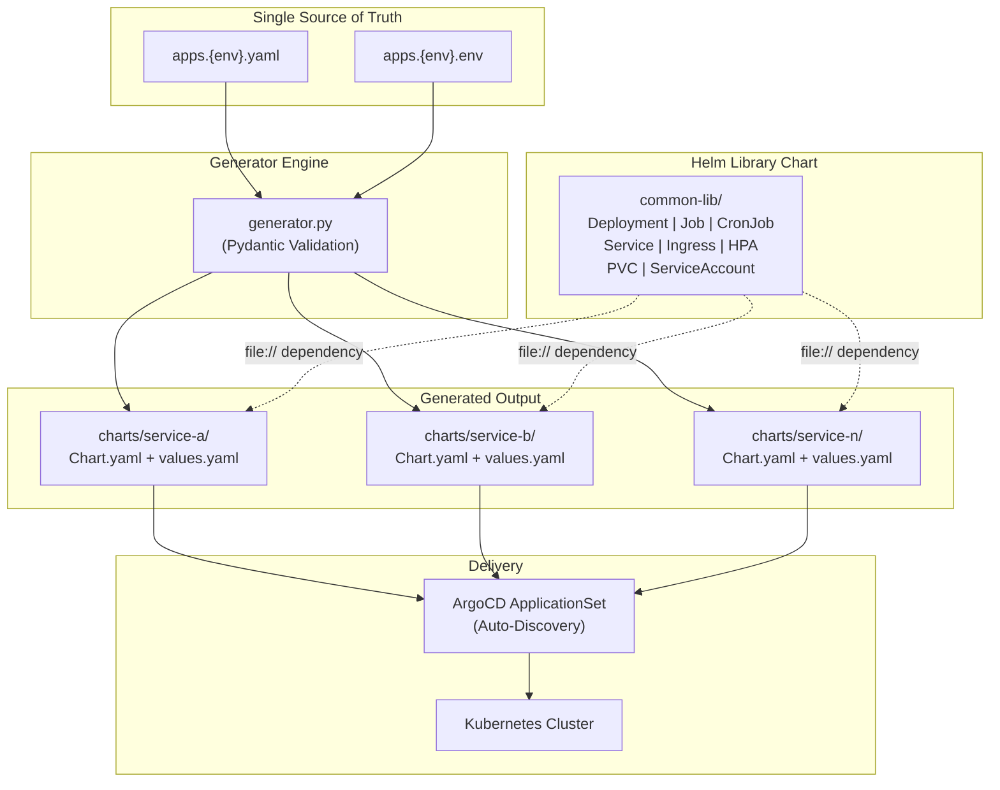
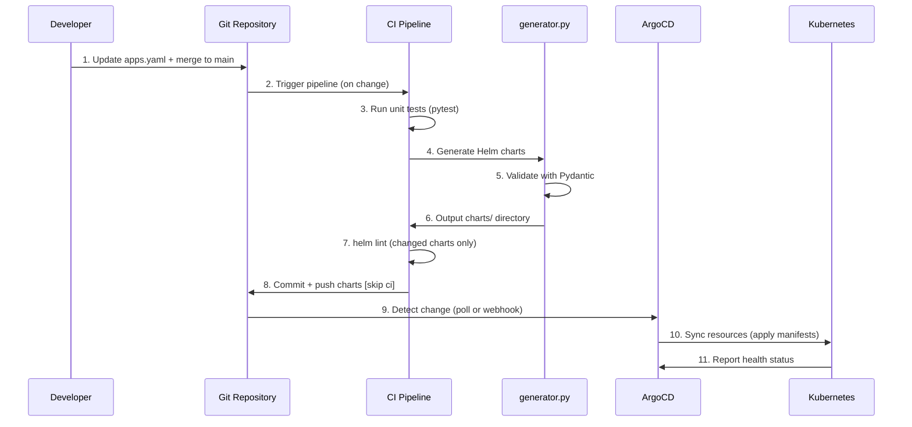
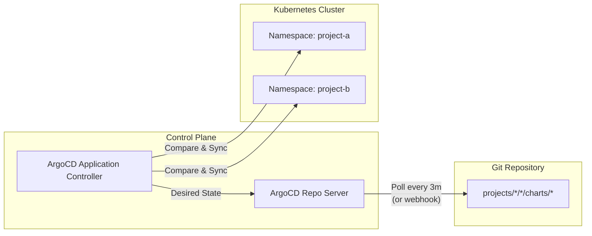

# GitOps Engine

A production-grade Helm Monorepo framework designed to standardize Kubernetes deployments across multiple teams and projects. It uses a **Python-based configuration generator** combined with a **shared Helm Library Chart** to eliminate boilerplate, enforce security baselines, and power a fully automated GitOps delivery pipeline.

---

## Table of Contents

- [Introduction and Architecture](#introduction-and-architecture)
- [Design Philosophy: 3-Layer Configuration Model](#design-philosophy-3-layer-configuration-model)
- [Repository Structure](#repository-structure)
- [Workflow](#workflow)
- [Getting Started](#getting-started)
- [Manual Operation](#manual-operation)
- [ArgoCD Automation (GitOps)](#argocd-automation-gitops)
- [Configuration Reference](#configuration-reference)
- [CI/CD Integration](#cicd-integration)
- [Secret Management](#secret-management)
- [Best Practices](#best-practices)

---

## Design Philosophy: 3-Layer Configuration Model

GitOps Engine uses a **3-layer progressive disclosure model**. Operators only need to know the layer relevant to their use case. Each layer is a superset of the previous.

```
┌──────────────────────────────────────────────────────────────────────┐
│  Layer 3 — Native Escape Hatch  (k8s:)                    ~5% usage  │
│  Full K8s API at any spec level for advanced cases                   │
├──────────────────────────────────────────────────────────────────────┤
│  Layer 2 — Config Objects                                ~15% usage  │
│  Rich objects for less-common but structured options                 │
├──────────────────────────────────────────────────────────────────────┤
│  Layer 1 — Shorthand                                     ~80% usage  │
│  Concise keys covering the most common deployment needs              │
└──────────────────────────────────────────────────────────────────────┘
```

### Layer 1 — Shorthand (80% of use cases)

Simple, flat keys for the most common options. No deep nesting required.

```yaml
- name: my-api
  port: 8080
  replicas: 3
  image: registry.vn/platform/my-api:v1.2.0

  health:
    enabled: true
    path: /healthz

  resources:
    limits:   { cpu: "500m", memory: "512Mi" }
    requests: { cpu: "100m", memory: "128Mi" }

  envs:
    - name: LOG_LEVEL
      value: "info"
    - secretEnv: my-api-secret        # inject all keys from secret via envFrom
    - name: POD_IP                    # Downward API shorthand
      valueFrom:
        fieldRef:
          fieldPath: status.podIP

  volumes:
    - name: cache
      mountPath: /tmp/cache
      emptyDir: {}
    - name: nfs-data                  # NFS shorthand — no escape hatch needed
      mountPath: /mnt/data
      nfs:
        server: nfs.internal
        path: /exports/data

  ingress:
    enabled: true
    host: my-api.example.com
```

### Layer 2 — Config Objects (15% of use cases)

Structured objects for options that have multiple sub-fields or multiple modes.

```yaml
- name: web-frontend
  # Full RollingUpdate tuning (Lớp 1 only supports type string)
  strategy:
    type: RollingUpdate
    rollingUpdate:
      maxSurge: 2
      maxUnavailable: 0

  # NodePort service with explicit port mapping
  service:
    type: NodePort
    ports:
      - name: http
        port: 80
        targetPort: 8080
        nodePort: 30080

  # HPA with behavior tuning
  hpa:
    enabled: true
    minReplicas: 2
    maxReplicas: 10
    targetCPUUtilizationPercentage: 70
    behavior:
      scaleDown:
        stabilizationWindowSeconds: 300

  # CronJob with full scheduling options
  cronjob:
    schedule: "0 2 * * *"
    concurrencyPolicy: Forbid
    successfulJobsHistoryLimit: 5

  # Job with retry and TTL options
  job:
    backoffLimit: 3
    ttlSecondsAfterFinished: 3600
    restartPolicy: OnFailure
```

### Layer 3 — Native Escape Hatch (5% of use cases)

When Layers 1 and 2 are not sufficient, use the `k8s:` block to deep-merge native
Kubernetes fields at any spec level. The engine performs a recursive strategic merge —
existing fields are preserved unless explicitly overridden.

```yaml
- name: legacy-bridge
  k8s:
    # pod: → merges into Pod spec
    pod:
      hostAliases:
        - ip: "10.0.0.99"
          hostnames: ["internal-svc.local"]
      dnsPolicy: "None"
      dnsConfig:
        nameservers: ["10.96.0.10"]

    # mainContainer: → merges into main container spec
    mainContainer:
      lifecycle:
        preStop:
          exec:
            command: ["/bin/sh", "-c", "sleep 10"]

    # deployment: → merges into Deployment spec
    deployment:
      minReadySeconds: 15
      progressDeadlineSeconds: 600

    # service: / ingress: → merge into Service / Ingress spec
    service:
      sessionAffinity: ClientIP

    # job: / cronjob: → merge into Job / CronJob spec
    job:
      podFailurePolicy:
        rules:
          - action: FailJob
            onExitCodes:
              operator: In
              values: [42]
    cronjob:
      timeZone: "Asia/Ho_Chi_Minh"
```

**Design rules for `k8s:`:**

| Rule | Detail |
|------|--------|
| **Merge, not replace** | `deep_update` merges dicts recursively; scalars are overwritten |
| **List dedup** | Lists are extended, deduplicated by `name`/`key` field |
| **Last wins** | `k8s:` overrides are applied **after** all generator logic |
| **Full K8s API** | Any valid Kubernetes field can be declared — no whitelist |

> [!TIP]
> Start with Layer 1. Only move to Layer 2 when you need structured options.
> Only use `k8s:` as a last resort — if a field is frequently needed, it should
> become a Layer 1 or Layer 2 option in a future release.

---


## Introduction and Architecture

### The Problem

In a microservices architecture, each service typically requires its own Helm chart with a Deployment, Service, Ingress, HPA, ServiceAccount, and PVC. Maintaining dozens of near-identical charts leads to:

- **Configuration drift** across services
- **Security inconsistencies** (missing resource limits, privileged containers)
- **High maintenance cost** when updating shared patterns (e.g., adding pod annotations)

### The Solution: Generic Chart Pattern

GitOps Engine solves this with a **Library Chart + Generator** architecture. Instead of writing Helm charts per service, teams declare their desired state in a single `apps.yaml` file. The Python generator reads this file and produces fully-rendered, per-service Helm charts that depend on a shared library (`common-lib`).



**Key Design Decisions:**

| Decision | Rationale |
|:---|:---|
| Library Chart (not Umbrella) | Each service gets its own Helm release, enabling independent lifecycle management |
| Python Generator (not Helm values alone) | Enables inference logic, cross-field validation, and conditional resource generation |
| Pydantic Validation | Catches misconfigurations at generation time, not at deploy time |
| `file://` dependency | No chart registry required; works with any Git-based workflow |

### Supported Workload Types

| Type | Kubernetes Resource | Use Case |
|:---|:---|:---|
| `deployment` | Deployment + optional HPA | Web servers, APIs, workers |
| `job` | Job | Database migrations, one-time tasks |
| `cronjob` | CronJob | Scheduled backups, cleanup jobs |

---

## Repository Structure

```
gitops-engine/
|-- argocd/
|   `-- applicationset.yaml        # ArgoCD ApplicationSet for auto-discovery
|-- helm-templates/
|   `-- common-lib/                # Shared Helm Library Chart
|       |-- Chart.yaml
|       `-- templates/
|           |-- _helpers.tpl        # Name, label, and selector helpers
|           |-- _main.tpl           # Entry point: routes to deployment/job/cronjob
|           |-- _pod.tpl            # Shared pod spec (containers, volumes, probes)
|           |-- _deployment.yaml
|           |-- _job.yaml
|           |-- _cronjob.yaml
|           |-- _service.yaml
|           |-- _ingress.yaml
|           |-- _hpa.yaml
|           |-- _pvc.yaml
|           `-- _serviceaccount.yaml
|-- projects/
|   `-- <env>/
|       `-- <project>/
|           |-- apps.<env>.yaml     # Application definitions (Source of Truth)
|           |-- apps.<env>.env      # Environment variables and secret placeholders
|           `-- charts/             # Generated Helm charts (gitignored or committed by CI)
|-- scripts/
|   |-- generator.py               # Python generator engine
|   |-- test_generator.py          # pytest test suite (155 tests)
|   |-- deploy.sh                  # CI orchestration script
|   |-- vault_sync.sh              # HashiCorp Vault secret synchronization
|   `-- requirements.txt           # Python dependencies
|-- examples/
|   |-- apps.example.yaml          # Comprehensive configuration examples
|   |-- apps.example.env           # Environment file example
|   `-- .gitlab-ci.yml.example     # CI pipeline example
|-- .gitlab-ci.yml                 # Production CI pipeline
`-- README.md
```

---

## Workflow

The deployment workflow follows a **Write-back GitOps** pattern where CI generates manifests and commits them back to the repository. ArgoCD then detects changes and applies them to the cluster.



### Stages

1. **Test** -- Unit tests validate the generator logic before any chart is produced.
2. **Secret Sync** -- `vault_sync.sh` synchronizes secrets from Vault to Kubernetes Secrets.
3. **Deploy Orchestration** -- `deploy.sh` runs the generator, lints changed charts, then commits and pushes.

---

## Getting Started

### Prerequisites

- Python 3.11+
- Helm v3.12+
- kubectl configured with cluster access
- (Optional) ArgoCD installed on the target cluster

### Setup

```bash
# Clone the repository
git clone https://github.com/cuonghv00/gitops-engine.git
cd gitops-engine

# Create and activate a virtual environment
python3 -m venv .venv
source .venv/bin/activate

# Install dependencies
pip install -r scripts/requirements.txt

# Verify the test suite
python -m pytest scripts/test_generator.py -v
```

### Create a New Project

```bash
# Create project directory structure
mkdir -p projects/dev/my-project

# Create the app definition file
cat > projects/dev/my-project/apps.dev.yaml << 'EOF'
project: "my-project"
common_version: "1.0.0"
image_repo: "registry.example.com/my-project"
image_tag: "v1.0.0"

apps:
  - name: "api-server"
    port: 8080
    replicas: 2
    ingress:
      enabled: true
      host: "api.example.com"
    health:
      enabled: true
      path: "/healthz"
    resources:
      limits:
        cpu: "500m"
        memory: "512Mi"
      requests:
        cpu: "100m"
        memory: "128Mi"
EOF

# Generate charts
python3 scripts/generator.py --project my-project --env dev
```

---

## Manual Operation

### Generating Charts

The generator reads `apps.<env>.yaml` and produces Helm charts in the `charts/` directory.

```bash
# Basic generation
python3 scripts/generator.py --project <project-name> --env <environment>

# With a specific image tag (overrides all apps)
python3 scripts/generator.py --project my-project --env dev --image-tag v2.0.0

# Dry-run mode (print output without writing files)
python3 scripts/generator.py --project my-project --env dev --dry-run

# Strict mode: reject 'latest' tag
python3 scripts/generator.py --project my-project --env dev --image-tag latest
# ERROR: uses non-deterministic image tag 'latest'
```

### Validating Charts

```bash
cd projects/dev/my-project/charts

# Lint a specific chart
helm dependency update api-server/
helm lint api-server/

# Render templates to inspect generated manifests (no cluster required)
helm template api-server api-server/ --debug

# Render and validate against the K8s API (requires cluster access)
helm template api-server api-server/ | kubectl apply --dry-run=server -f -
```

`helm lint` validates chart structure and template syntax. `helm template` renders the final YAML manifests, which is useful for reviewing the exact resources that will be created.

### Deploying to a Cluster

```bash
cd projects/dev/my-project/charts

# Deploy a single service
helm dependency update api-server/
helm upgrade --install api-server api-server/ \
    --namespace my-project \
    --create-namespace

# Deploy all services in the project
for chart in */; do
    app_name=$(basename "$chart")
    helm dependency update "$chart"
    helm upgrade --install "$app_name" "$chart" \
        --namespace my-project \
        --create-namespace
done

# Uninstall a service
helm uninstall api-server --namespace my-project
```

**Flags Reference:**

| Flag | Purpose |
|:---|:---|
| `--install` | Install the release if it does not exist, otherwise upgrade |
| `--create-namespace` | Create the target namespace if it does not exist |
| `--namespace` | Target Kubernetes namespace |
| `--dry-run` | Simulate the install without applying to the cluster |
| `--wait` | Wait until all resources are ready before marking the release as successful |
| `--timeout 5m` | Set a deadline for `--wait` |

---

## ArgoCD Automation (GitOps)

### How It Works

ArgoCD implements a **pull-based** GitOps model. Unlike push-based CI/CD where the pipeline pushes changes to the cluster, ArgoCD continuously monitors the Git repository and reconciles the cluster state to match the desired state in Git.



**Key Behaviors:**

| Feature | Behavior |
|:---|:---|
| **Self-Heal** | If a resource is manually modified on the cluster, ArgoCD reverts it to the Git-defined state |
| **Auto-Prune** | If a chart directory is removed from Git, ArgoCD deletes the corresponding resources |
| **Auto-Discovery** | The ApplicationSet scans `projects/*/*/charts/*` and creates an Application for each chart |

### Deploying the ApplicationSet

The ApplicationSet only needs to be applied **once** per cluster. It will automatically discover and manage all services across all projects and environments.

```bash
kubectl apply -f argocd/applicationset.yaml -n argocd
```

### ApplicationSet Configuration

```yaml
# argocd/applicationset.yaml
apiVersion: argoproj.io/v1alpha1
kind: ApplicationSet
metadata:
  name: platform-monorepo-apps
  namespace: argocd
spec:
  generators:
    - git:
        repoURL: https://github.com/cuonghv00/gitops-engine.git
        revision: HEAD
        directories:
          - path: projects/*/*/charts/*
  template:
    metadata:
      # Prefixed with project name to prevent cross-project name collisions
      name: '{{path.segments[2]}}-{{path.basename}}'
      labels:
        project: '{{path.segments[2]}}'
        env: '{{path.segments[1]}}'
    spec:
      project: '{{path.segments[2]}}'
      source:
        repoURL: https://github.com/cuonghv00/gitops-engine.git
        targetRevision: HEAD
        path: '{{path}}'
        helm:
          valueFiles:
            - values.yaml
      destination:
        server: https://kubernetes.default.svc
        namespace: '{{path.segments[2]}}'
      syncPolicy:
        automated:
          prune: true
          selfHeal: true
        syncOptions:
          - CreateNamespace=true
          - ApplyOutOfSyncOnly=true
          - ServerSideApply=true
```

### Single Application (Alternative)

For teams that prefer explicit control over each application, use a standalone Application manifest instead of the ApplicationSet.

```yaml
apiVersion: argoproj.io/v1alpha1
kind: Application
metadata:
  name: my-project-api-server
  namespace: argocd
spec:
  project: my-project
  source:
    repoURL: https://github.com/cuonghv00/gitops-engine.git
    targetRevision: main
    path: projects/dev/my-project/charts/api-server
    helm:
      valueFiles:
        - values.yaml
  destination:
    server: https://kubernetes.default.svc
    namespace: my-project
  syncPolicy:
    automated:
      prune: true
      selfHeal: true
    syncOptions:
      - CreateNamespace=true
```

---

## Configuration Reference

All application configuration is defined in `apps.<env>.yaml`. The generator validates every field using Pydantic models with `extra='forbid'`, meaning **typos and unknown fields are caught at generation time**.

### Project-Level Fields

| Field | Type | Default | Description |
|:---|:---|:---|:---|
| `project` | string | **required** | Project name (must be a valid K8s DNS name) |
| `common_version` | string | `"1.0.0"` | Library chart version (semver required) |
| `namespace` | string | `null` | Target namespace override |
| `image_repo` | string | `"registry.vn/platform"` | Default image registry/repository prefix |
| `image_tag` | string | `"latest"` | Default image tag for all apps |
| `imagePullSecrets` | list | `[{name: regcred}]` | Docker registry credentials |
| `pvcs` | list | `[]` | Project-level PersistentVolumeClaims |

### Application-Level Fields

#### Core

| Field | Type | Default | Description |
|:---|:---|:---|:---|
| `name` | string | **required** | Application name (valid K8s DNS name, max 63 chars) |
| `type` | string | `"deployment"` | Workload type: `deployment`, `job`, or `cronjob` |
| `replicas` | int | `1` | Pod replica count (omitted when HPA is enabled) |
| `image` | string | `null` | Full image URI (e.g., `redis:7.2-alpine`, `gcr.io/proj/app:v1`) |
| `image_tag` | string | `null` | Per-app tag override |
| `pullPolicy` | string | `"IfNotPresent"` | Image pull policy |
| `k8s` | object | `{}` | **Native Escape Hatch** - Deep-merge K8s overrides for `pod`, `deployment`, `mainContainer`, `service`, `ingress` |

#### Networking

| Field | Type | Default | Description |
|:---|:---|:---|:---|
| `port` | int | `null` | Shorthand: single container port |
| `ports` | list | `[]` | Multi-port definitions (`name`, `port`, `targetPort`, `protocol`) |
| `service` | bool/object | auto | Service configuration or `false` to disable |
| `ingress.enabled` | bool | `false` | Enable Ingress resource |
| `ingress.host` | string | `null` | Ingress hostname |
| `ingress.className` | string | `"nginx"` | Ingress class |
| `ingress.annotations` | map | `{}` | Merged with Nginx defaults when `className=nginx` |
| `ingress.tls` | list | `null` | TLS configuration |

#### Health Checks

| Field | Type | Default | Description |
|:---|:---|:---|:---|
| `health.enabled` | bool | `false` | Enable liveness, readiness, and startup probes |
| `health.path` | string | `null` | HTTP path (uses TCP socket if unset) |
| `health.port` | int/string | container port | Probe target port |
| `health.liveness` | string/object | `null` | Override: HTTP path string or full `ProbeConfig` |
| `health.readiness` | string/object | `null` | Override: HTTP path string or full `ProbeConfig` |
| `health.startup` | string/object | `null` | Override: HTTP path string or full `ProbeConfig` |
| `health.grpc` | object | `null` | gRPC health check configuration |

#### Resources and Scaling

| Field | Type | Default | Description |
|:---|:---|:---|:---|
| `resources.limits.cpu` | string | none | CPU limit (e.g., `"500m"`) |
| `resources.limits.memory` | string | none | Memory limit (e.g., `"512Mi"`) |
| `resources.requests.cpu` | string | none | CPU request |
| `resources.requests.memory` | string | none | Memory request |
| `hpa.enabled` | bool | `false` | Enable HorizontalPodAutoscaler |
| `hpa.minReplicas` | int | `1` | Minimum replica count |
| `hpa.maxReplicas` | int | `5` | Maximum replica count |
| `hpa.targetCPUUtilizationPercentage` | int | `null` | CPU scaling target |
| `hpa.targetMemoryUtilizationPercentage` | int | `null` | Memory scaling target |
| `hpa.behavior` | object | `{}` | Advanced scaling behavior (stabilization windows) |

#### Security

| Field | Type | Default | Description |
|:---|:---|:---|:---|
| `serviceAccount.create` | bool | `true` | Create a dedicated ServiceAccount |
| `serviceAccount.automountToken` | bool | `false` | Mount SA token into pods |
| `securityContext` | object | hardened | Container-level security context |
| `podSecurityContext` | object | hardened | Pod-level security context |

#### Environment Variables

```yaml
envs:
  # Plain key-value
  - name: LOG_LEVEL
    value: "info"

  # Per-key secret injection (secretKeyRef)
  - secretEnv: my-project-secret
    vars: [DB_PASSWORD, API_KEY]

  # Inject ALL keys from a Vault-synced secret (envFrom) by omitting 'vars'
  - secretEnv: my-project-secret

  # Inject all keys from a ConfigMap
  - configMap: global-config

  # Inject all keys from a Secret
  - secret: external-api-keys
```

#### Volumes

```yaml
volumes:
  # PVC reference
  - name: data
    mountPath: /data
    pvc: shared-storage

  # EmptyDir (in-memory)
  - name: cache
    mountPath: /tmp/cache
    emptyDir: { medium: Memory }

  # ConfigMap
  - name: config
    mountPath: /etc/config
    configMap: app-config

  # Secret as file
  - name: certs
    mountPath: /etc/ssl/certs
    secret: tls-cert
    readOnly: true
```

#### Batch Workloads

`job` and `cronjob` blocks are dynamic: **all native K8s fields are allowed and passed seamlessly** to the manifests (e.g., `completionMode`, `suspend`, `activeDeadlineSeconds`). Common properties include:

| Field | Type | Default | Description |
|:---|:---|:---|:---|
| `job.backoffLimit` | int | `6` (K8s default) | Retry limit before marking Job as failed |
| `job.ttlSecondsAfterFinished` | int | `null` | Auto-cleanup delay after completion |
| `job.restartPolicy` | string | `"Never"` | Pod restart policy (`Never` or `OnFailure`) |
| `cronjob.schedule` | string | **required** | Cron expression (e.g., `"0 2 * * *"`) |
| `cronjob.concurrencyPolicy` | string | `"Allow"` | `Allow`, `Forbid`, or `Replace` |
| `cronjob.suspend` | bool | `false` | Pause scheduling |

### Inference Logic

The generator applies the following inference rules to minimize manual configuration:

| Feature | Inference Rule |
|:---|:---|
| Image URI | Defaults to `{image_repo}/{app-name}:{image_tag}` when `image` is not set |
| Service | Auto-created when `port`, `ports`, or `ingress` is defined |
| Port Mapping | Service port maps to container port. Defaults to `80` if nothing is defined |
| Health Checks | HTTP probe at `path` if set; TCP socket probe if `path` is omitted |
| `/tmp` Volume | Auto-mounted as emptyDir when `readOnlyRootFilesystem: true` (default) |
| Nginx Annotations | Default `ssl-redirect: false` and `proxy-body-size: 8m` merged with user overrides |

---

## CI/CD Integration

### GitLab CI (Production Pipeline)

The repository includes a production-ready `.gitlab-ci.yml` with three stages:

```yaml
stages:
  - test                  # Validate generator logic
  - sync-secrets          # Sync secrets from Vault
  - deploy-orchestration  # Generate, lint, commit, push
```

**Pipeline Requirements:**

| Requirement | Purpose |
|:---|:---|
| `CI_SSH_DEPLOY_KEY` | SSH private key for Git push-back (stored as CI variable) |
| `VAULT_ADDR` | HashiCorp Vault server URL |
| `VAULT_TOKEN` | Vault authentication token |
| Helm v3 | Installed in CI image for `helm lint` |

**Trigger Rules:**

- **Test stage**: Runs on changes to `scripts/`, `projects/**/*.yaml`, or merge requests
- **Secret sync**: Runs on changes to `apps.*.yaml` or `vault_sync.sh`
- **Deploy**: Runs on changes to `apps.*.yaml`, `helm-templates/`, or `scripts/`

### GitHub Actions (Alternative)

```yaml
# .github/workflows/deploy.yml
name: GitOps Deploy
on:
  push:
    branches: [main]
    paths:
      - 'projects/**/*.yaml'
      - 'helm-templates/**'
      - 'scripts/**'

jobs:
  test:
    runs-on: ubuntu-latest
    steps:
      - uses: actions/checkout@v4
      - uses: actions/setup-python@v5
        with:
          python-version: '3.11'
      - run: pip install -r scripts/requirements.txt
      - run: python -m pytest scripts/test_generator.py -v

  deploy:
    needs: test
    runs-on: ubuntu-latest
    steps:
      - uses: actions/checkout@v4
        with:
          ssh-key: ${{ secrets.DEPLOY_KEY }}
      - uses: actions/setup-python@v5
        with:
          python-version: '3.11'
      - run: pip install -r scripts/requirements.txt
      - name: Generate and Push
        run: |
          chmod +x scripts/deploy.sh
          ./scripts/deploy.sh \
            --project ${{ vars.PROJECT }} \
            --env ${{ vars.ENV }} \
            --image-tag ${{ github.run_id }}
```

### Immutable Image Tags

The CI pipeline uses `$CI_PIPELINE_ID` (GitLab) or `${{ github.run_id }}` (GitHub) as the image tag. This ensures:

- Every deployment is traceable to a specific pipeline run
- Rollbacks are deterministic (no tag mutation)
- The `latest` tag is rejected in strict mode (`--allow-latest` must be explicitly passed)

---

## Secret Management

Secrets are managed externally via HashiCorp Vault and synchronized to the cluster using `vault_sync.sh`. **No secret data is stored in Git.**

### Kubernetes Mode

Syncs Vault KV-v2 secrets directly to a Kubernetes Secret resource.

```bash
./scripts/vault_sync.sh <vault-path> <secret-name> <namespace>

# Example
./scripts/vault_sync.sh "secret/data/ops-team/my-project/dev" "my-project-secret" "my-project"
```

### VM Mode

Upserts Vault secrets into a local `.env` file with deduplication logic.

```bash
./scripts/vault_sync.sh vm <vault-path> <env-file-path>

# Example
./scripts/vault_sync.sh vm "secret/data/ops-team/my-project/dev" /opt/app/.env
```

### Environment File Convention

The `apps.<env>.env` file uses a convention to separate config from secrets:

```bash
# Literals -> ConfigMap (injected via envFrom)
DB_HOST=postgres.svc.cluster.local
LOG_LEVEL=info

# Placeholders -> Expected in K8s Secret (synced from Vault)
DB_PASSWORD=${DB_PASSWORD}
JWT_SECRET=${JWT_SECRET}
```

---

## Best Practices

### Security

The generator enforces the following security baselines **by default**. All settings can be overridden per-app when necessary.

**Container-Level (applied to main container):**

| Setting | Default | Purpose |
|:---|:---|:---|
| `readOnlyRootFilesystem` | `true` | Prevents runtime writes to the container filesystem |
| `allowPrivilegeEscalation` | `false` | Blocks privilege escalation via `setuid`/`setgid` |
| `runAsNonRoot` | `true` | Rejects containers attempting to run as UID 0 |
| `runAsUser` | `1000` | Explicit non-root UID |
| `capabilities.drop` | `["ALL"]` | Drops all Linux capabilities |

**Pod-Level:**

| Setting | Default | Purpose |
|:---|:---|:---|
| `runAsNonRoot` | `true` | Enforced at pod level (defense-in-depth) |
| `fsGroup` | `1000` | Sets GID for mounted volumes |

**ServiceAccount:**

| Setting | Default | Purpose |
|:---|:---|:---|
| `automountServiceAccountToken` | `false` | Prevents automatic token injection (RBAC hardening) |

**Automatic `/tmp` Mount**: When `readOnlyRootFilesystem` is `true`, the generator auto-injects an emptyDir volume at `/tmp` so applications can write temporary files. This can be disabled via `auto_mount_tmp: false`.

### Resource Management

- **Always define resource requests and limits.** The generator emits a warning when `resources` is empty. Missing limits risk noisy-neighbor issues and cluster instability.
- **Use HPA for variable workloads.** When `hpa.enabled: true`, the generator omits the `replicas` field from the Deployment spec to prevent a control-loop conflict between the Deployment controller and the HPA controller.
- **Set at least one HPA metric target.** The generator validates that `targetCPUUtilizationPercentage` or `targetMemoryUtilizationPercentage` is set when HPA is enabled.

### Image Tagging

- **Never use `latest` in production.** The generator warns on `latest` by default and rejects it when `--allow-latest` is not passed.
- **Use immutable tags** tied to pipeline IDs or Git SHAs for traceability.
- **Embedded tags are supported.** `image: "redis:7.2-alpine"` is parsed correctly, including images from registries with port numbers (e.g., `registry:5000/app:v1`).

### Init Containers and Sidecars

- **Classic init containers** (no `restartPolicy`) do not receive health probes, auto-injected ConfigMaps, or forced security contexts. This prevents breaking third-party images.
- **Native sidecars** (`restartPolicy: Always` in `initContainers`) support the full probe lifecycle.
- **Traditional sidecars** (in the `sidecars` list) run alongside the main container with full probe and lifecycle support.

### Naming Conventions

All names (project, app, PVC, container) must conform to **Kubernetes DNS naming rules**:

- Lowercase alphanumeric characters and dashes only
- Must start and end with an alphanumeric character
- Maximum 63 characters

The generator validates names at generation time and provides clear error messages.

---

## Testing

The project includes a comprehensive pytest test suite covering model validation, builder output, integration scenarios, and security assertions.

```bash
# Run all tests
python -m pytest scripts/test_generator.py -v

# Run a specific test class
python -m pytest scripts/test_generator.py::TestHPA -v

# Run with coverage (requires pytest-cov)
python -m pytest scripts/test_generator.py --cov=scripts.generator --cov-report=term-missing
```

**Test Coverage Areas (155 tests):**

| Area | Tests | Description |
|:---|:---|:---|
| Pydantic Validation | 35+ | EnvItem, VolumeItem, AppConfig, ProjectPVC mutual exclusion |
| Builder Functions | 25+ | `build_env_items`, `build_volume_items` output correctness |
| Integration | 30+ | `build_values_yaml` end-to-end with envs, volumes, ingress |
| Image Resolution | 11 | Embedded tags, registry ports, override priority chain |
| Security | 10+ | Pod vs container context separation, init container isolation |
| Batch Workloads | 15 | Job/CronJob config, service disabled, type guards |
| HPA | 10 | Replica omission, metric validation, type restrictions |

---

## License

This project is proprietary. See the LICENSE file for details.
